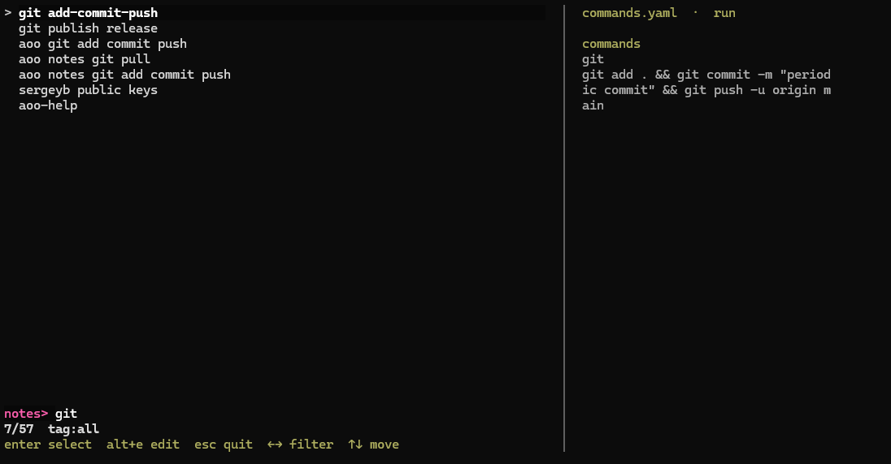

# aoo

Fast terminal notes and command launcher.

Store notes, commands, hosts, and snippets in YAML. Use fuzzy search across note contents, find what you need in seconds, and run commands directly from notes.



## Install

```bash
git clone https://github.com/sergeybychkovvvpgroup-beep/aoo.git
cd aoo
make build
sudo install -m 0755 bin/aoo /usr/local/bin/aoo
```

Install `.deb` manually:

```bash
sudo dpkg -i ./aoo_<version>_amd64.deb
```

## First Run

On first start, `aoo` can ask for your notes repo URL and clone it into `~/.local/share/aoo/notes`.

Main settings now live in one file:

```bash
~/.config/aoo/config.yaml
```

The file is auto-created with comments and examples.

You can also configure it manually:

```bash
aoo set-source
mkdir -p ~/.local/share/aoo/notes
aoo set-folder ~/.local/share/aoo/notes
aoo set-app-dir ~/workspace/aoo
```

If the notes repo is private, `aoo` prints the public key that should be added to Deploy Keys.
`aoo` does not auto-fetch notes repo on every start, so it will not keep asking for your SSH key passphrase.

Check config:

```bash
aoo config
aoo config show
```

Useful UI settings in `config.yaml`:

```yaml
full_screen: true
picker_height: 14
show_preview: true
preview_pane: false
```

## Usage

```bash
aoo
aoo validate --dir ~/.local/share/aoo/notes
```

Themes:

```bash
aoo themes
aoo set-theme catppuccin-mocha
```

Picker shortcuts:

```text
Enter   open actions for selected note
Alt+E   open selected note source in $VISUAL / $EDITOR
Esc     quit
Left/Right switch tag filter
Up/Down move
```

## Notes Format

```yaml
- desc: example ssh
  actions:
    - desc: show
      text: main host access
    - desc: ssh
      cmd: ssh admin@example.local

- desc: example url
  actions:
    - desc: show
      text: https://service.example.local

- desc: example nmap template
  tags: [nmap, scan]
  actions:
    - desc: nmap
      template: sudo nmap -O {{host}}
      args:
        - name: host
          prompt: Host or IP
          example: 192.168.1.1
```

Behavior:

- `Enter` always opens an action selector for the note
- `actions` is the primary format
- `text` shows text
- `cmd` runs a command after confirmation
- `template` asks for args, renders the final command, then asks for confirmation
- `full_screen: true` uses the terminal alternate screen and full terminal height
- when `full_screen: false`, picker height is limited by `picker_height`, so prior terminal output stays visible
- `show_preview: false` makes each search result a single line
- `preview_pane: true` shows a right-side preview panel like `fzf`
- each action should have its own `desc`

Multiple actions in one note:

```yaml
- desc: grep
  actions:
    - desc: show
      text: common grep variants
    - desc: grep in syslog
      cmd: grep -i error /var/log/syslog
    - desc: grep with context
      cmd: grep -nC 3 error /var/log/syslog

- desc: himki
  actions:
    - desc: show
      text: main site access
    - desc: ssh vyos
      cmd: ssh vyos@himki
    - desc: ssh tunnel
      cmd: ssh -L 8443:10.10.10.1:443 vyos@himki
      banner: https://127.0.0.1:8443
```

Built-in template variables:

- `{{aoo_notes_dir}}`
- `{{aoo_app_dir}}`
- `{{aoo_config_file}}`

Config command example:

```yaml
- desc: edit aoo config
  actions:
    - desc: open
      cmd: $EDITOR {{aoo_config_file}}
```

## Themes

- `catppuccin-mocha`
- `catppuccin-latte`
- `dracula`
- `nord`
- `solarized-dark`
- `solarized-light`

## Repo Layout

- `examples/notes/` safe example notes for validation and demo
- `cmd/`, `internal/` application code
- `internal/bundled/` built-in help and starter notes

## Releases

- Push a tag like `v0.2.0` to trigger GitHub Release autobuilds
- Release workflow publishes tarballs and `.deb` packages
